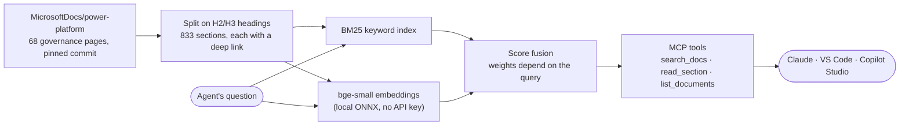

# Power Platform Governance MCP Server

[](https://github.com/kellycjones/power-platform-governance-mcp/actions/workflows/ci.yml)
[](LICENSE)

An [MCP](https://modelcontextprotocol.io) server that lets AI agents answer Power Platform governance questions (data policies, connectors, environments, Managed Environments, security roles, the CoE Starter Kit and ALM) from Microsoft's own documentation, with a link to the exact section behind every answer.

It works with Claude (Desktop and Code), VS Code and Copilot Studio, runs entirely on your machine, and needs no API keys.

```text
> search_docs "what does Get-AdminPowerAppConnectorAction return"   (6 ms)

1. Connector action control › PowerShell support for connector action control
   https://learn.microsoft.com/power-platform/admin/connector-action-control#powershell-support-for-connector-action-control
   id: admin/connector-action-control#4 · matched by keyword + semantic
   Retrieve a list of available actions for a connector, using `Get-AdminPowerAppConnectorAction`. …

> search_docs "How do I stop makers from using the HTTP connector?"   (21 ms)

1. Connector classification
   https://learn.microsoft.com/power-platform/admin/dlp-connector-classification
   id: admin/dlp-connector-classification#1 · matched by keyword + semantic
   Because child flows share an internal dependency with the HTTP connector, the grouping that admins
   choose for HTTP connectors in a data policy might affect the ability to run child flows …
```

## Why this exists

Admins ask governance questions in two very different ways: in plain English ("who can create new environments?") and by exact name (`limitSharingMode`, `Get-AdminPowerAppConnectorAction`). Keyword search handles the second and fails the first; embedding search does the opposite. This server combines both, and ships with an evaluation showing that the combination beats either one alone.

I build agents and MCP servers for enterprise Microsoft clients, and that client code stays private. This is a small public version of the same pattern: hybrid retrieval over a documentation library, exposed to agents through MCP, and measured.

## How it works



- **Ingestion** ([`scripts/fetch-corpus.ts`](scripts/fetch-corpus.ts), [`src/corpus/markdown.ts`](src/corpus/markdown.ts)): downloads 68 pages at a pinned commit, strips Learn-specific markup (`[!INCLUDE]`, `:::image:::`, callouts, videos, link lists) and splits each page on its headings. Every section keeps a deep link to `learn.microsoft.com/...#anchor`, so an agent can cite the exact paragraph.
- **Keyword search** ([`src/search/bm25.ts`](src/search/bm25.ts)): BM25 with a light stemmer. Words with internal capitals (camelCase settings, PascalCase cmdlet nouns) count three times as much as ordinary words, so "turn off `disableAdminDigest`" isn't swamped by pages that say "turn off" a lot.
- **Semantic search** ([`src/embedder.ts`](src/embedder.ts)): [bge-small-en-v1.5](https://huggingface.co/BAAI/bge-small-en-v1.5) runs locally through transformers.js. The model is about 35 MB, downloads once, and the whole index embeds in about 20 seconds on a laptop CPU. The `Embedder` interface makes Azure OpenAI a drop-in swap.
- **Fusion** ([`src/search/hybrid.ts`](src/search/hybrid.ts)): each retriever's scores are normalized to 0–1 and combined with weights that depend on the query. Plain-English questions lean on semantic search; questions that name an identifier lean on keywords.
- **MCP server** ([`src/server.ts`](src/server.ts)): three read-only tools with typed input *and* output schemas, a `governance_question` prompt, and server instructions that tell the agent to cite its sources.
- **Transports** ([`src/index.ts`](src/index.ts), [`src/http.ts`](src/http.ts)): stdio for local clients; stateless Streamable HTTP for remote ones like Copilot Studio, with API-key auth (constant-time comparison), DNS-rebinding protection, a `/healthz` endpoint and JSON-lines logs on stderr (one line per tool call, with latency).

## Evaluation

[`eval/questions.json`](eval/questions.json) has 35 questions, each labeled with the page that answers it. 28 are plain-English paraphrases that avoid the docs' wording; 7 name an exact cmdlet or setting. `npm run eval` scores every search configuration:

| Search | Right page first (hit@1) | In top 5 (hit@5) | MRR | Paraphrase hit@1 | Exact-term hit@1 |
|---|---|---|---|---|---|
| Keyword only (BM25) | 74% | 86% | 0.79 | 68% | 100% |
| Semantic only | 83% | 97% | 0.88 | 86% | 71% |
| Hybrid, reciprocal rank fusion | 80% | 94% | 0.85 | 82% | 71% |
| **Hybrid, score fusion (default)** | **89%** | **97%** | **0.91** | **86%** | **100%** |

What the numbers showed along the way:

- **The usual default made things worse.** Reciprocal rank fusion (RRF) is the standard way to merge two result lists, but here it scored below semantic search alone. It only looks at rank order, so a decisive exact-name match at keyword rank 1 gets outvoted by a page that ranks "pretty well" in both lists. Normalizing and adding scores keeps the size of that lead.
- **The embedding model mattered more than the fusion method.** Swapping all-MiniLM-L6-v2 for bge-small-en-v1.5 raised semantic-only hit@1 from 74% to 83%.
- **A reranker wasn't worth it yet.** A cross-encoder (ms-marco-MiniLM-L-6-v2) over the top 30 results added about half a second per query for small gains on the hard questions, so it's not in the default path.
- **Known miss:** "Is the CoE Starter Kit still being updated?" should surface the page saying the kit no longer gets new features, but the 16 other CoE pages all talk about the kit too, and they win. That's the next thing to fix.

35 questions is a small set, and the fusion weights were chosen on it, so read this as a regression check rather than a benchmark. Other weightings I tried scored 83–86% hit@1.

## Quick start

Requires Node.js 22 or later.

```bash
git clone https://github.com/kellycjones/power-platform-governance-mcp.git
cd power-platform-governance-mcp
npm install
npm run setup    # downloads the docs, builds the search index, compiles (about a minute)
npm run demo     # runs three sample questions through a real MCP client
```

Ask your own: `npm run demo -- "can I block specific connector actions?"`

## Connect it to an agent

**Claude Code**

```bash
claude mcp add pp-governance -- node /absolute/path/to/power-platform-governance-mcp/dist/index.js
```

**Claude Desktop**: add this to `claude_desktop_config.json`:

```json
{
  "mcpServers": {
    "pp-governance": {
      "command": "node",
      "args": ["/absolute/path/to/power-platform-governance-mcp/dist/index.js"]
    }
  }
}
```

**VS Code**: open the folder; [`.vscode/mcp.json`](.vscode/mcp.json) already registers the server.

**Copilot Studio** (over HTTP):

1. Start the server with a key: `MCP_API_KEY=<a long random string> npm run start:http` (listens on `http://127.0.0.1:3000/mcp`).
2. Give it a public HTTPS URL, for example with a [dev tunnel](https://learn.microsoft.com/azure/developer/dev-tunnels/): `devtunnel host -p 3000 --allow-anonymous`. Set `MCP_ALLOWED_HOSTS` to the tunnel's hostname so the server accepts requests addressed to it.
3. In your Copilot Studio agent, add a tool of type **Model Context Protocol** with the tunnel URL ending in `/mcp`, and choose API-key authentication sent in an `x-api-key` header.

For production, host it on Azure Container Apps or App Service behind Entra ID or API Management. The server is stateless, so it scales out without sticky sessions.

## Tools

| Tool | Input | Returns |
|---|---|---|
| `search_docs` | `query`, optional `area` (`admin`, `alm`, `coe`), `limit` 1–10 | Ranked sections: title, heading, deep-link URL, snippet, score, and which retrievers matched |
| `read_section` | `id` from `search_docs` | Full section text with its citation URL |
| `list_documents` | optional `area` | Every indexed page, with the pinned source commit and license |

Prompt: `governance_question(question)` tells the agent to search, read and answer with a citation for each claim.

## Project layout

```text
src/
  index.ts            CLI: loads the index, picks stdio or HTTP
  server.ts           MCP tools, prompt and instructions
  http.ts             Streamable HTTP transport, API-key auth
  embedder.ts         Local embeddings (transformers.js)
  index-store.ts      Index file format (float32 vectors, base64-packed)
  corpus/markdown.ts  Learn Markdown to clean sections with deep links
  search/             BM25, vector search, fusion
scripts/              fetch-corpus, build-index, demo, eval
eval/questions.json   Labeled questions for npm run eval
test/                 Vitest: parsing, ranking, fusion, MCP over memory and HTTP
```

## Development

```bash
npm test            # 31 tests; offline, using a deterministic fake embedder
npm run typecheck
npm run eval        # retrieval quality on the labeled questions
```

To pick up newer docs, change `COMMIT` in [`scripts/corpus-manifest.ts`](scripts/corpus-manifest.ts), add or remove pages in `DOCS`, and re-run `npm run setup && npm run eval`.

## Credits and license

Code: MIT, © 2026 Kelly Jones. The documentation this server searches belongs to Microsoft and is used under [CC BY 4.0](https://creativecommons.org/licenses/by/4.0/). It's downloaded at setup, not stored in this repo; see [NOTICE.md](NOTICE.md). Not affiliated with or endorsed by Microsoft.
